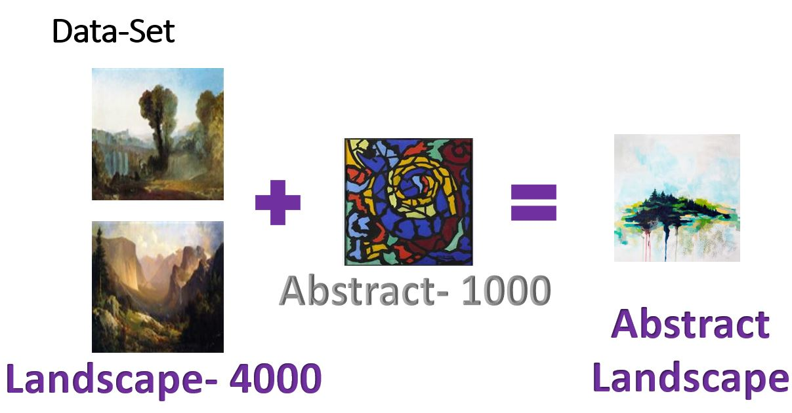
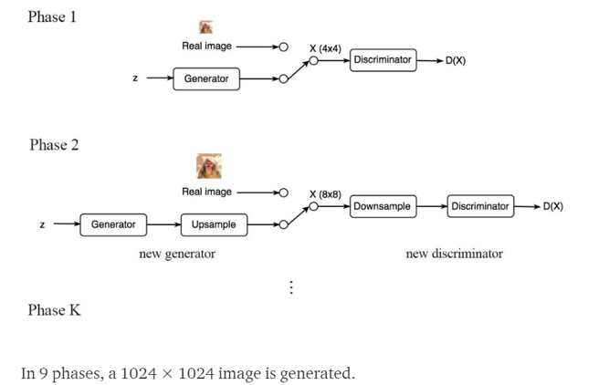

# Welcome to GANSCAPE STUDIO.
# [Live Demo](http://3.15.32.149:8501/)

## Requirement:  Flask, 1 GPU, Pytorch, Python 3.6, Matplot, NumPy

## Results
###150 epoch- 5th Depth - Batch size 32 

## Dataset Details:

## Progressive GAN:

## Use Pretrained weights

## How to Use the project for your custom dataset:

# Insight-ExclusiveArtZoo
